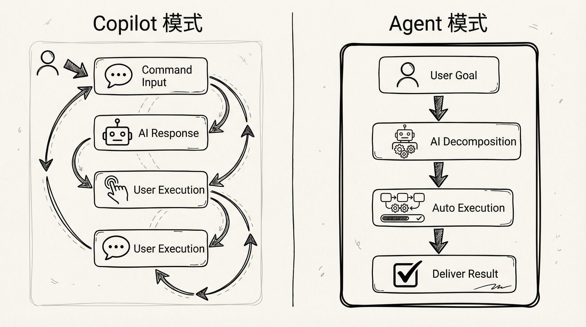
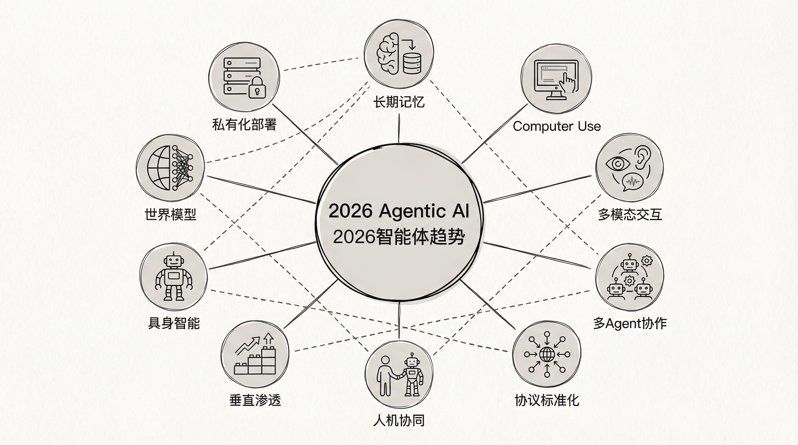
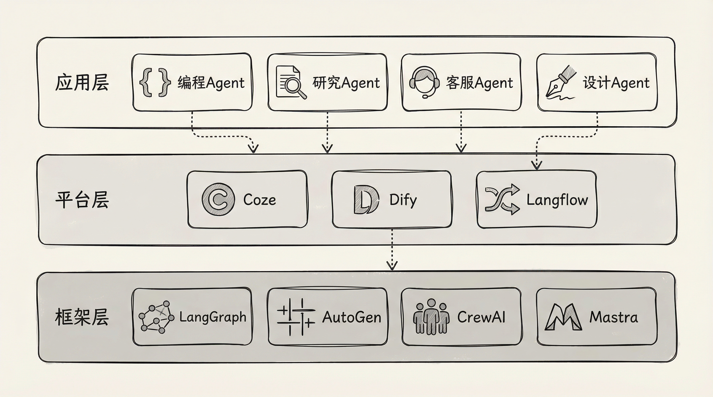
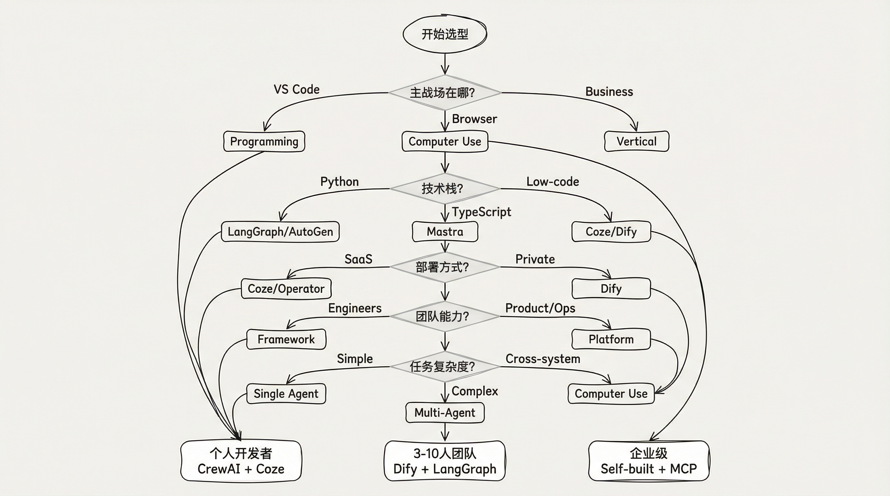
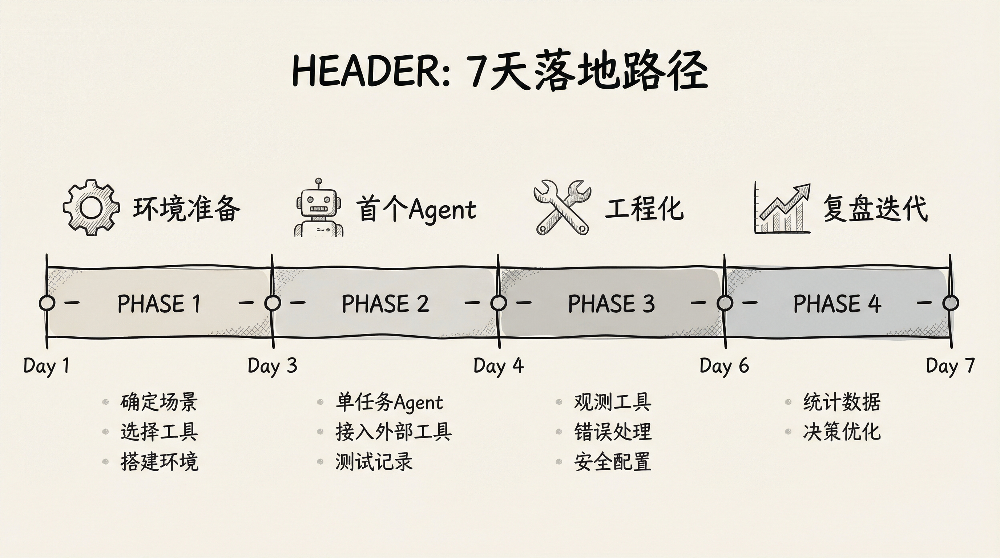

# Copilot已死，Agent当立：2026智能体工程化工具图谱

## 你缺的不是更好的模型，而是能自己干活的Agent

上篇聊完插件层，这篇必须聊Agent。

插件解决的是"工具调用"问题，Agent解决的是"任务闭环"问题。

2025年你还在问"哪个模型好"，2026年该问"哪个Agent能自己把活干完"。

区别很简单：Copilot等你下指令，Agent自己拆解、执行、交付。

---

## 2026年Agentic AI十大趋势（一句话版）

别被研报吓到，核心就10条：

**1. 长期记忆成标配**
Agent能记住数周前的上下文，不再"金鱼脑"。

**2. Computer Use普及**
像人一样操作浏览器、软件、系统，不只是生成代码。

**3. 多模态交互**
语音、图像、视频输入，Agent真正"看懂"世界。

**4. 多Agent协作**
一个任务拆给多个Agent并行，效率提升300%+。

**5. 协议标准化**
MCP、A2A成为Agent时代的TCP/IP，互通互联。

**6. 人机协同团队**
"Agent管理者"成为新角色，人类管战略，Agent管执行。

**7. 垂直领域渗透**
金融、医疗、制造、编程，行业专用Agent爆发。

**8. 具身智能落地**
人形机器人走出实验室，进入真实场景。

**9. 世界模型共识**
从"预测下一个词"到"预测世界状态"，AGI方向明确。

**10. 私有化部署**
端侧模型、私有云Agent，数据主权受重视。

---

## 工具分层体系：从框架到落地

别贪多，每层选一两个深耕就够了。

### 框架层：核心引擎

**LangGraph**（推荐）
- 状态机驱动的Agent编排
- 适合复杂流程、需要精确控制的场景
- 学习曲线陡峭，但上限极高

**AutoGen**（微软出品）
- 多Agent对话协作框架
- 角色扮演、对话式任务分解
- 适合需要多个"专家"协作的场景

**CrewAI**（新手友好）
- 基于角色的Agent团队编排
- 声明式配置，代码量少
- 快速原型首选

**Mastra**（TypeScript生态）
- 现代TS技术栈，开发体验好
- 内置工作流、RAG、评估体系
- 2024年底开源，社区增长快

**选型建议：**
- 个人学习 → CrewAI
- 企业落地 → LangGraph / Mastra
- 多Agent研究 → AutoGen

### 平台层：可视化与部署

**Coze Studio**（字节跳动）
- 可视化Agent开发平台
- 插件生态丰富，上线门槛低
- 国内首选，免费额度 generous

**Dify**（开源）
- 完整的LLM应用开发平台
- 支持工作流、RAG、Agent模式
- 可私有化部署，企业友好

**Langflow**（LangChain生态）
- 拖拽式工作流编排
- 适合非技术用户快速搭建
- 与LangChain生态深度集成

**选型建议：**
- 快速验证 → Coze
- 企业私有化 → Dify
- 已有LangChain基础 → Langflow

【配图：平台层功能对比】

### 应用层：垂直场景

**编程Agent**
- **Block/Goose**：能执行、编辑、测试代码
- **Cline**：VS Code深度集成，开源可定制
- **Roo Code**：多模型支持，Agent工作流完善

**研究Agent**
- **virattt/dexter**：金融研究专用
- **AutoGLM**：智谱AI出品，替代人类操作电子设备

**客服Agent**
- **XianyuAutoAgent**：闲鱼客服机器人
- **Coze客服模板**：快速搭建企业客服

**设计Agent**
- **jaaz**：AI设计智能体，具备设计、编辑、生成图像能力

**选型建议：**
先明确场景，再选工具。通用Agent不如专用Agent靠谱。

---

## 选型决策框架：5个问题定位

别被工具列表淹没，回答这5个问题：

**Q1：你的主战场在哪？**
- VS Code → 选编程Agent
- 浏览器/多系统 → 选Computer Use能力强的
- 特定业务场景 → 选垂直Agent

**Q2：技术栈是什么？**
- Python生态 → LangGraph / AutoGen
- TypeScript/现代Web → Mastra
- 低代码 → Coze / Dify

**Q3：部署方式要求？**
- SaaS接受 → Coze、OpenAI Operator
- 必须私有化 → Dify、开源框架自建

**Q4：团队技术能力？**
- 有专业工程师 → 框架层自建
- 产品/运营主导 → 平台层配置

**Q5：任务复杂度？**
- 单步骤任务 → 简单Agent
- 多步骤、需决策 → 多Agent编排
- 跨系统操作 → Computer Use能力必备

**快速推荐：**

| 场景 | 推荐方案 |
|------|----------|
| 个人开发者 | CrewAI + Coze |
| 3-10人团队 | Dify私有化 + LangGraph |
| 企业级 | 自研框架（LangGraph/Mastra）+ MCP生态 |

---

## 7天落地路径

别追求完美，先跑通一个最小闭环。

**Day 1-2：环境准备**
- 确定1个具体场景（如：自动整理周报）
- 选择工具（建议CrewAI或Coze入门）
- 搭建基础环境

**Day 3-4：首个Agent**
- 完成单任务Agent（如：读取邮件→提取要点→生成摘要）
- 接入至少1个外部工具（API、数据库等）
- 测试并记录问题

**Day 5-6：工程化接入**
- 接入观测工具（日志、追踪）
- 添加错误处理和重试机制
- 安全边界配置（权限限制、人工确认点）

**Day 7：复盘与迭代**
- 统计：任务成功率、平均耗时、错误类型
- 决定：继续优化 / 切换工具 / 放弃场景

**关键认知：**
第一版Agent大概率不好用。重点不是一次做对，而是建立"需求→Agent→反馈→迭代"的闭环。

---

## 一句话结论

2026年，评价AI能力的标准变了。

不再是"它懂多少"，而是"它能自己干多少"。

别再盯着模型排行榜。

选一个框架，搭一个Agent，让它今天就开始帮你干活。

哪怕是自动整理邮件这种小事。

**附：资源清单**
- LangGraph: github.com/langchain-ai/langgraph
- CrewAI: github.com/crewAIInc/crewAI
- Mastra: github.com/mastra-ai/mastra
- Dify: github.com/langgenius/dify
- Coze: coze.cn

下一篇预告：《AI编程从0到1之10X提效》第6篇——AI工作流编排：从单点工具到系统交付

---

*参考资料：*
- [2026年Agentic AI十大关键趋势](https://m.thepaper.cn/newsDetail_forward_32317179)
- [智源研究院《2026十大AI技术趋势》](https://news.sciencenet.cn/htmlnews/2026/1/558462.shtm)
- [15篇AI Agent研报](https://zhuanlan.zhihu.com/p/1996902325206405568)
