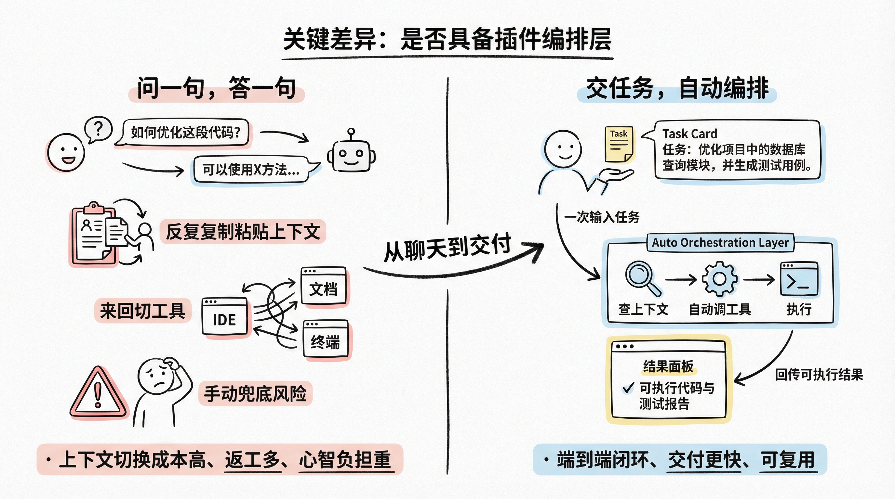
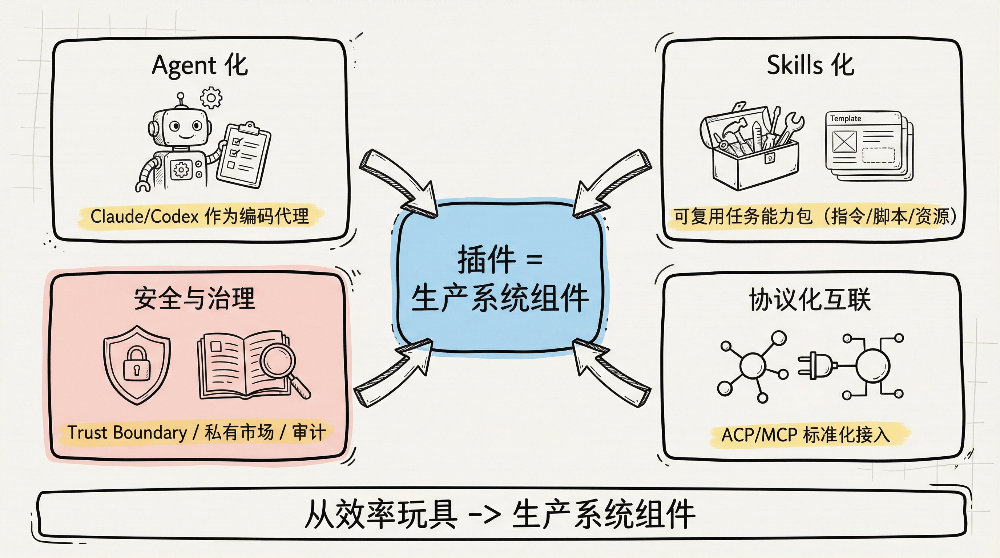
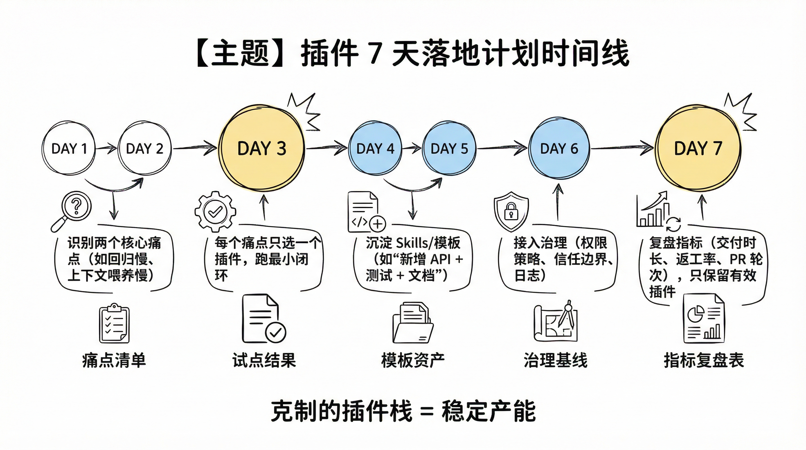

# AI编程从0到1之10X提效（Extensions/Plugins 扩展插件）
## 你缺的不是下一个大模型，而是“最后一公里”的插件层

很多人聊 AI 编程，只盯着模型和 IDE。

但我这半年最深的体感是：真正把效率拉开 3-10 倍差距的，往往不是“你用哪个模型”，而是你有没有把 **Extensions/Plugins 这层能力**搭好。

模型像发动机，IDE 像车身，插件层才是方向盘、导航和刹车系统。

没有这层，你会一直重复三件事：复制粘贴上下文、来回切工具、手动兜底风险。写着写着就心态崩了。

---

## 先统一认知：插件不是“锦上添花”，而是工作流编排器

以前我也把插件当“小功能补丁”。

后来发现，AI 编程时代的插件已经不是“给编辑器换皮肤”，而是在重构你的开发路径：

从“我问一句、它答一句”，变成“我交一个任务，它自己调工具、查上下文、执行、回传结果”。

说直白点，插件层决定你是在“用 AI 聊天”，还是在“用 AI 交付”。

*AI 时代最贵的成本，不是 token，而是上下文切换。*

---

## 2026 年的 4 个明确信号：插件生态已经进入“工程化阶段”

这不是感受，是公开产品动作给出的信号。

**信号 1：插件能力开始“Agent 化”**

GitHub 在 **2026 年 2 月 4 日**正式把 Claude 和 Codex 作为编码代理接入 GitHub（Public Preview），并可从 GitHub、Mobile、VS Code 发起会话。这意味着插件不再只是“补全”，而是可被分配任务的执行体。

**信号 2：技能（Skills）正在成为插件的新形态**

GitHub 在 **2025 年 12 月 18 日**发布 Copilot Agent Skills。它本质上是“可复用的任务能力包”：指令、脚本、资源可按需加载。你可以把团队最佳实践沉淀成技能，而不只是口头 SOP。

**信号 3：IDE 正在把协议级扩展（ACP/MCP）做成标准能力**

JetBrains AI Assistant 版本说明里，已经明确出现 ACP-compatible agents、MCP server transport、BYOK 等能力。这说明插件开始从“单点功能”走向“协议互联”。

**信号 4：安全与治理被抬到同等优先级**

VS Code 已明确把 Trust boundary 做成体系：Workspace Trust、Extension Publisher Trust、MCP Server Trust。并且在 **2025 年 11 月 18 日**发布了 Private Marketplace，面向团队做“可审计、可白名单、可内部分发”的插件治理。

一句话：2026 年的插件，不再是“效率玩具”，而是“生产系统组件”。

---

## 热门插件观察

你点名的这几个方向，我按 X 的公开页面做了同口径检索。先说结论：

`Roo Code` 的社区热度最清晰，`Kiro` 的争议话题传播最快，`augmentcode` 和 `cline` 有稳定讨论，但未登录态公开搜索页很难直接拿到统一互动量。

### 1) Roo Code：开发者社区热度最“可见”

`@roo_code` 账号简介直接定位为“VS Code 里的 AI 代理开发团队”，并显示 **7,495 Followers**（抓取页时间戳为近 5 个月内快照）。

这类账号量级在垂直编程插件赛道里，已经是“有持续讨论面”的级别，不是一次性爆点。

### 2) Kiro：话题传播快，但争议也大

- 新 IDE + Claude Code 组合带来的效率提升讨论
- Amazon 内部工具优先策略与工程师真实使用偏好的冲突讨论

### 3) Augment Code：专业开发者圈层关注，偏工程深水区

`augmentcode` 相关检索页持续有新帖流（Top/Latest 入口可见），更偏向“长上下文工程能力、Agent 质量”的讨论语境。

适合放在“中大型仓库/团队工程化”的插件段落，不建议和入门插件放在同一推荐层。

### 4) Cline：声量稳定，主要集中在“开源 Agent 工作流”讨论

`cline coding` 检索页持续有内容流入口，且在开发者账号简介中出现“prev head of ai @cline”等强关联标签。

实操角度上，Cline 更适合放在“可定制、多工具编排”的路线，而不是“开箱即用最省事”的路线。

### 5) 这 4 个插件怎么写进你的选型结论

如果你的目标是“先起量再稳态”，我会这样建议：

- **Roo Code**：先做个人效率试点，验证 Agent 工作流是否适配你的仓库。
- **Cline**：做可定制编排备选，适合愿意自己打磨流程的人。
- **Augment Code**：放在复杂工程场景评估，重点看跨文件理解与回归质量。
- **Kiro**：重点关注与现有 IDE/团队规范的兼容性，避免只看热度上头。

这四个不是互斥关系，更像是不同阶段的工具位。

---

## 怎么选插件，不看“火不火”，看这 5 个问题

每次有人问我“装哪些插件”，我都会先反问这 5 个。

### 1. 你的主工作流到底在哪？

如果你主要在 VS Code 里完成从需求到 PR，就优先选与 VS Code Agent/Chat 深度耦合的扩展。

如果你是 JetBrains 重度用户，就不要强行迁移，先吃透 AI Assistant + MCP/ACP 能力。

工具统一，才有复利。

### 2. 它能不能减少“上下文搬运”？

好插件的第一价值不是“更聪明”，是“更少复制粘贴”。

你要看它是否能直接接入仓库、Issue、PR、文档、终端、外部服务。

凡是还要你手动喂上下文三四轮的，都是伪提效。

### 3. 它有没有执行护栏？

能跑命令、改文件、发请求的插件很强，但也很危险。

至少要确认：

- 是否支持受限模式与权限边界
- 是否能审计操作日志
- 是否能限制工作区范围
- 是否能控制外部服务连接

效率和安全不是二选一，成熟团队两者都要。

### 4. 它能否沉淀团队方法，而不是个人手感？

你今天觉得好用，不代表团队明天也能复现。

优先选择支持 Skills、模板、命令编排、可共享配置的插件体系。这样“高手经验”才不会变成“高手离职即消失”。

### 5. 你的总成本有没有变低？

别只看订阅价。

把返工率、回归问题、代码评审时长、交付周期算进去，才是总成本。很多“免费插件”最后最贵，因为把你的人力烧掉了。

---

## 我自己在用的一套插件分层（可直接抄）

我现在不追求“装最多”，只保留能闭环交付的最小组合。

### 第 1 层：编码执行层

负责写、改、重构、解释代码。

核心要求：多文件修改能力、可控 agent 行为、模型可切换。

### 第 2 层：上下文连接层

负责把外部世界接进来：文档、Issue、API、知识库、内部平台。

核心要求：协议化接入（如 MCP）、低摩擦授权、上下文可追溯。

### 第 3 层：质量防线层

负责把“能跑”变成“可上线”：测试、Lint、类型检查、安全扫描。

核心要求：插件结果能接入 CI，不做“本地幻觉通过”。

### 第 4 层：治理审计层

负责权限、发布、白名单、日志、策略。

核心要求：个人与团队规则一致，避免“我机子能跑、线上翻车”。

*插件分层的目标不是复杂化，而是把返工前置。*

---

## 最容易踩的 3 个坑

### 坑 1：把插件当“功能超市”

装了 30 个，真正长期在用的不到 5 个，还互相冲突。

解决方法：每个插件都要绑定一个明确指标，比如“PR 合并周期下降 20%”。达不到就卸载。

### 坑 2：只看生成速度，不看验证链路

生成快不代表交付快。

没有测试和回归兜底，速度越快，返工越多。

### 坑 3：只顾个人效率，不顾团队复制

你本地爽了，团队学不会、接不住，最终还是组织效率下降。

插件选型要优先“可复制”，不是“炫技”。

---

## 7 天落地计划：把插件从“玩具”变成“产能”

如果你想马上看到变化，我建议按这个节奏走。

**Day 1-2**：梳理你当前开发流程里最痛的 2 个环节（比如改动回归慢、上下文喂养慢）。

**Day 3**：为每个痛点只选 1 个插件方案，先跑最小闭环，不做大而全。

**Day 4-5**：把常见任务写成 Skills/模板（例如“新增 API + 测试 + 文档更新”）。

**Day 6**：接入基础治理：权限策略、信任边界、操作日志。

**Day 7**：复盘指标：交付时长、返工率、PR 讨论轮次。只保留有实证收益的插件。

你会发现，真正有用的插件体系并不臃肿，反而很克制。

---

## 一句话结论

Extensions/Plugins 的本质，不是“多一个按钮”，而是把你的 AI 编程流程做成可复用、可治理、可交付的系统。

别再问“还有什么插件推荐”。

先问这句：**我现在的插件栈，能不能稳定把需求变成上线结果？**

如果答案是否定的，这篇就是你该动手重构的起点。

如果你愿意，我下一篇可以直接给你一套：
“个人开发者版”和“3-10 人小团队版”的插件栈清单（含取舍理由和迁移顺序）。

---
