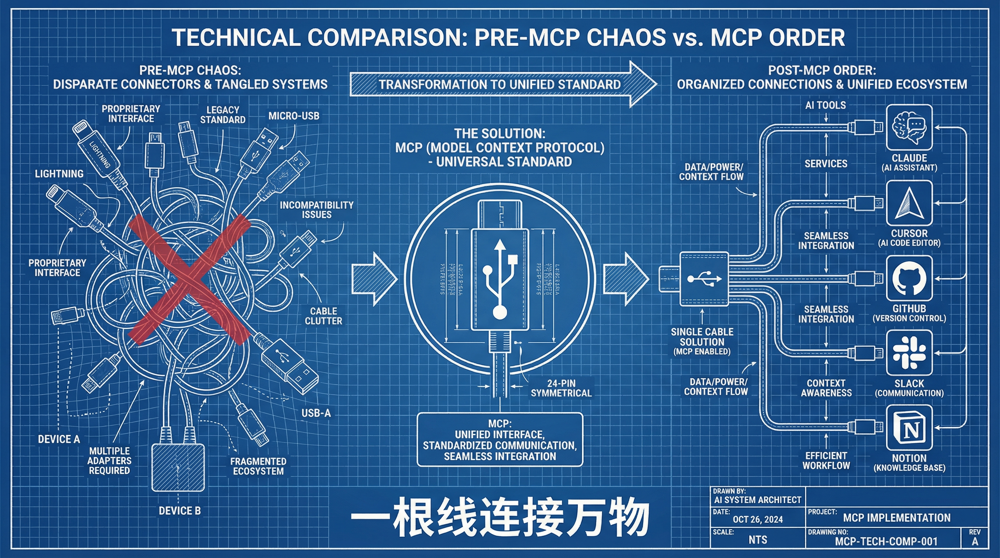
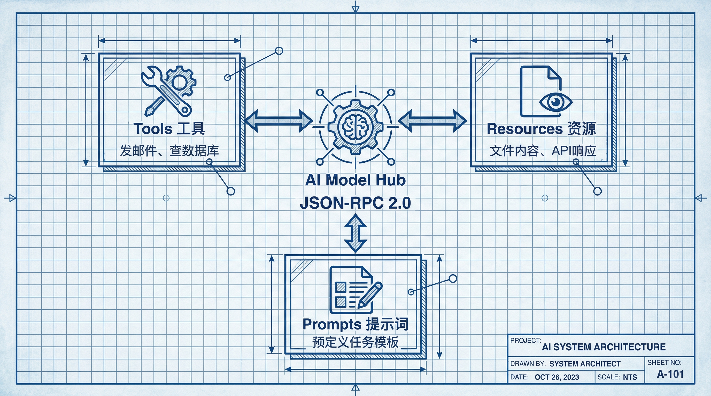
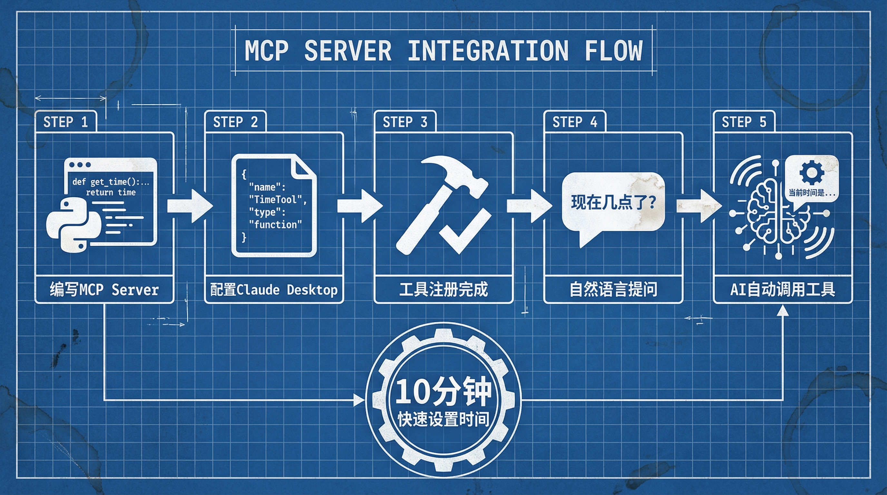
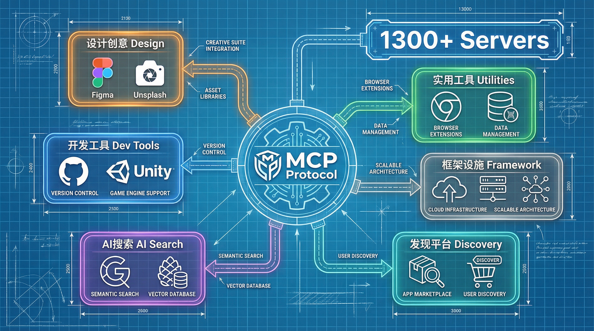

# 从Claude到全平台：MCP协议入门指南，10分钟让你的AI应用学会调用工具

> *一张协议标准图，胜过一千行适配代码。*

---

先问大家一个问题：

你有没有算过，为了让AI助手能查天气、发邮件、操作GitHub，你写过多少"胶水代码"？

我算过。光是给Claude接 Slack、Notion、GitHub 这三个工具，我就写了将近800行代码。每个工具一套API、一种认证方式、一种错误处理逻辑。更痛苦的是，当我想把这套东西搬到另一个项目时，发现要重写一大半。

这不是我一个人的烦恼。几乎所有做AI应用开发的，都在重复造轮子。

直到MCP出现。

---

## 一、MCP是什么？为什么它被称为"AI界的USB-C"

MCP全称是 **Model Context Protocol**（模型上下文协议），由Anthropic在2024年推出，2025年底正式进入Linux基金会托管。

这个名字听起来很技术，但概念其实特别简单。

想象一下：在没有USB-C之前，你的手机、电脑、耳机各有各的充电口。出门得带三根线，麻烦得要死。USB-C出来之后，一根线搞定所有设备。

MCP干的就是这件事——它让AI模型和外部工具之间有了统一的对讲语言。

以前，你想让AI调用一个工具，得写一堆适配代码。现在，只要你的工具支持MCP，任何AI都能直接调用它。反过来也一样，只要你的AI支持MCP，它就能使用所有MCP生态里的工具。



目前MCP生态已经汇集了 **1000+社区服务器**，从GitHub、Slack、Notion到数据库、浏览器自动化、文件系统，应有尽有。

---

## 二、MCP的核心架构：三样东西就够了

MCP的架构设计非常简洁。你只需要理解三个核心概念：

**Tools（工具）** 是AI可以调用的功能函数。比如"发送邮件"、"查询数据库"、"创建GitHub Issue"。每个Tool都有明确的输入参数和返回值，AI能看懂、会用。

**Resources（资源）** 是AI可以读取的数据。比如文件内容、API响应、数据库记录。Resources是只读的，AI可以查询它们来获取上下文信息。

**Prompts（提示词模板）** 是预定义的任务模板。比如"帮我总结一下今天的Slack消息"就是一个Prompt，它封装了具体的调用逻辑。

整个通信基于 **JSON-RPC 2.0** 协议，传输层支持stdio（本地进程）和HTTP（远程服务）两种方式。



这意味着什么？你可以用任何语言写MCP Server——Python、Node.js、Go、Rust，随便你。只要符合协议规范，任何MCP Client都能调用它。

---

## 三、实操：10分钟搭建你的第一个MCP Server

光说不练假把式。下面我带你从零开始，用Python写一个最简单的MCP Server。

这个Server只做一件事：给AI提供一个"获取当前时间"的工具。

### 第一步：安装依赖

```bash
pip install mcp
```

MCP官方提供了Python SDK，安装就是一行命令的事。

### 第二步：写Server代码

创建一个文件叫 `time_server.py`：

```python
from mcp.server import Server
from mcp.types import TextContent
import datetime

# 创建Server实例
app = Server("time-server")

@app.tool()
async def get_current_time():
    """获取当前时间

    返回当前的日期和时间，格式为YYYY-MM-DD HH:MM:SS
    """
    now = datetime.datetime.now()
    return TextContent(
        type="text",
        text=f"当前时间：{now.strftime('%Y-%m-%d %H:%M:%S')}"
    )

# 启动Server
if __name__ == "__main__":
    app.run()
```

就这几行代码，一个MCP Server就写好了。

关键点在于 `@app.tool()` 装饰器。它把这个函数注册成一个Tool，函数名就是Tool名，docstring就是Tool的描述——AI会根据这个描述来决定什么时候调用它。

### 第三步：配置Claude Desktop

打开Claude Desktop的配置文件（`~/Library/Application Support/Claude/claude_desktop_config.json`），添加你的Server：

```json
{
  "mcpServers": {
    "time-server": {
      "command": "python3",
      "args": ["/path/to/time_server.py"]
    }
  }
}
```

重启Claude Desktop，你会在输入框下方看到一个小锤子图标。点一下，能看到你刚刚添加的`get_current_time`工具。

现在你可以问Claude："现在几点了？" 它会自动调用你的工具，获取时间，然后回答你。

---

## 四、进阶：让AI操作GitHub

上面那个例子太简单了，我们来个实用的——让AI帮你操作GitHub。

安装现成的GitHub MCP Server：

```bash
npx -y @modelcontextprotocol/server-github
```

配置文件中添加：

```json
{
  "mcpServers": {
    "github": {
      "command": "npx",
      "args": ["-y", "@modelcontextprotocol/server-github"],
      "env": {
        "GITHUB_PERSONAL_ACCESS_TOKEN": "你的Token"
      }
    }
  }
}
```

搞定之后，你可以对Claude说：

- "帮我查看最近更新的Issue"
- "给这个项目打个Star"
- "创建一个PR，标题是Fix typo"

Claude会自动调用相应的Tool来完成操作。你不需要写一行代码，只需要用自然语言描述你的需求。

这就是MCP的魔力。



---

## 五、MCP生态系统全景：从设计到开发的工具宇宙

GitHub只是冰山一角。现在的MCP生态已经发展成一个庞大的工具宇宙，涵盖了几乎所有你能想到的应用场景。

让我带你快速浏览一下这个生态系统的版图。

**设计与创意类**：Figma MCP Server让AI能直接操作设计稿，Unsplash Server可以搜索并插入图片，Excalidraw、Miro、draw.io也都有对应的MCP连接器。设计师现在可以用自然语言让AI帮忙改图、找素材、整理画板。

**开发与工具类**：除了GitHub，还有Unity MCP Server（游戏开发）、Playwright MCP（浏览器自动化测试）、FFmpeg MCP（音视频处理）。更夸张的是，你甚至可以用Chrome MCP Server让AI直接控制浏览器——填表单、点按钮、抓数据，全程自动化。

**AI与搜索类**：Google Search MCP让AI能实时搜索网络信息，解决了大模型知识截止的痛点。Pinecone MCP连接向量数据库，让AI能访问你的私有知识库。Exa MCP专门做网络搜索和爬取，Sora MCP甚至可以调用视频生成能力。

**实用工具与数据类**：有专门管理记忆的Memory MCP Server，有处理Markdown文档的MDX MCP，还有能访问Anna's Archive（电子书库）的学术搜索Server。想查天气？有天气MCP。想发邮件？有邮件MCP。想操作数据库？MySQL、PostgreSQL、MongoDB的MCP Server全都有。

**框架与基础设施**：除了官方SDK，社区还开发了fastmcp（TypeScript快速开发框架）、mcp-router（统一管理多个MCP服务器的应用）。这些工具让开发和部署MCP Server变得更加简单。

**发现平台与市场**：随着Server数量爆炸（PulseMCP声称每天追踪1320多个服务器），各种发现平台也应运而生——Cline的MCP Marketplace、Smithery、Context7、ModelScope的MCP广场。它们就像是MCP世界的"应用商店"，让你能轻松找到需要的工具。

*这意味着什么？*

AI助手不再是孤立的聊天机器人。通过MCP，它可以连接到一个庞大且不断增长的外部工具宇宙——从设计软件、搜索引擎到浏览器和专用数据库。它正在变成一个真正的"会使用工具的助手"，一个能帮你完成实际工作的数字实习生。



---

## 六、MCP带来的改变

用了MCP一段时间，我最大的感受是：**开发AI应用的方式变了**。

以前，我要做带工具调用的AI应用，得先调研每个工具的API，写适配代码，处理认证，处理错误，写测试……一个工具忙活一两天。

现在？

找个MCP Server，一行配置搞定。如果找不到现成的，花半小时写一个就是了。

更重要的是，**工具可以被复用**了。我写的Time Server，不仅Claude能用，Cursor能用，任何支持MCP的AI都能用。反过来，社区里的1000多个MCP Server，我都能直接拿来用。

*这才是真正的生态。*

而且，生态还在以肉眼可见的速度扩张。每天都有新的MCP Server发布，新的应用场景被发现。今天文章中列出的这些分类——设计、开发、搜索、自动化——可能只是冰山一角。再过几个月，说不定会有更多我们想象不到的用法出现。

---

## 七、总结：三个关键点

如果你刚接触MCP，记住这三件事就够了：

**第一，MCP是协议，不是某个具体工具。** 它定义的是AI和工具之间怎么"对话"，至于对话的内容是什么，完全由你决定。

**第二，MCP Server可以很小，也可以很大。** 从简单的获取时间，到复杂的浏览器自动化、数据库操作，都可以是一个Server。生态已经有很多现成的，但你也完全可以根据自己的需求写专属的。

**第三，MCP生态正在快速扩张。** 从设计软件、开发工具到搜索引擎、数据库，几乎所有领域都有对应的MCP Server。PulseMCP每天追踪1300多个服务器，还有各种发现平台帮你找到需要的工具。这个生态的丰富程度，决定了MCP的价值上限。

---

## 写在最后

技术的世界变化太快，新概念层出不穷。但MCP给我的感觉不太一样——它不是在增加复杂度，而是在降低复杂度。

用一套标准，解决一堆重复问题。这个思路，从来都是技术进步的方向。

如果你也在做AI应用开发，建议你花点时间了解一下MCP。不用多，10分钟搭个简单的Server试试看。等你感受到那种"配置一行，调用无限"的畅快感，你就明白我在说什么了。

有问题欢迎在评论区留言，或者去GitHub搜搜看社区里现成的MCP Server，说不定你要的功能别人已经写好了。

*毕竟在这个时代，会用工具的人，永远比只会写代码的人走得更远。*

---

**参考资源**：
- MCP官方文档：https://modelcontextprotocol.io/
- MCP官方服务器列表：https://github.com/modelcontextprotocol/servers
- **MCP生态系统发现平台**：
  - PulseMCP（追踪1300+服务器）：https://pulsemcp.com/
  - Cline MCP Marketplace：https://cline.bot/mcp-marketplace
  - Smithery：https://smithery.ai/
  - Context7：https://context7.com/
  - ModelScope MCP广场：https://www.modelscope.cn/mcp
