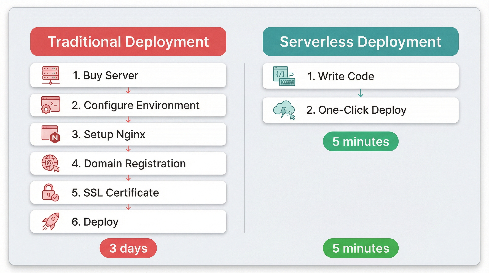
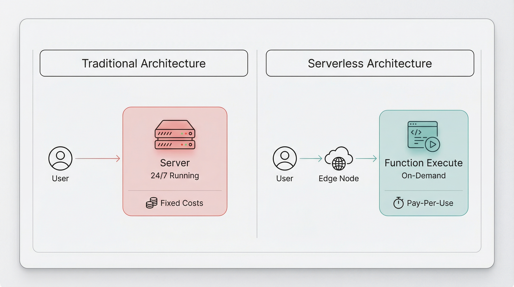
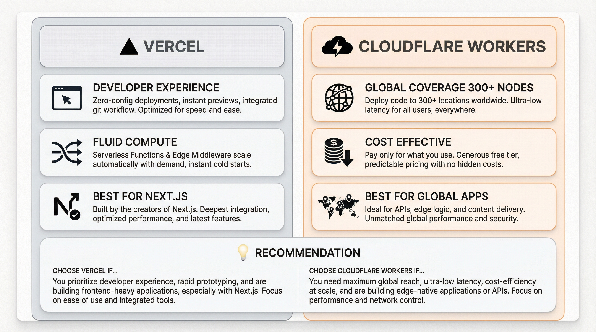

# AI编程从0到1之10X提效（Serverless API 服务接口）10篇

> 部署API，从买服务器到写代码只需5分钟。

说实话，我第一次听说"Serverless"的时候，心里是拒绝的。

"无服务器？那我的代码跑在哪儿？"

直到我为了部署一个简单的用户认证API，在传统服务器上折腾了整整3天——配环境、调Nginx、申请域名、备案、弄SSL证书...那一刻我才意识到，**2026年还在手动管理服务器，真的有点魔幻。**

这篇文章，我想和你分享我是如何用Serverless，在5分钟内让API在全球边缘节点跑起来的。



---

## 先问大家一个问题

你有没有遇到过这种情况——

写了个超酷的小工具，想分享给别人用，结果卡在"部署"这一关？

买服务器吧，最便宜的一年也要几百块，还不能保证稳定性。

用免费方案吧，不是有广告就是随时可能挂。

这种"代码写完了，但跑不起来"的憋屈感，我懂。

**Serverless的出现，本质上是在说：你只管写代码，其他的交给我。**

---

## Serverless到底是什么？

简单来说，Serverless就是"无服务器架构"。

但别被名字骗了——服务器当然还在，只是你不需要关心它。

以前部署一个API，你要考虑：
- 买什么配置的服务器
- 操作系统选CentOS还是Ubuntu
- Nginx怎么配反向代理
- 域名备案要多久
- SSL证书怎么自动续期
- 流量大了怎么扩容

而用Serverless，你只需要考虑一件事：**代码逻辑怎么写。**



左边是传统架构：用户请求 → 你的服务器 → 返回结果。服务器24小时开着，没人的时候也在烧钱。

右边是Serverless：用户请求 → 最近的边缘节点 → 冷启动（如果需要）→ 执行代码 → 返回结果。用多少付多少，不用的时候成本为零。

**2025-2026年，Serverless已经不再是"玩具"了。**

Vercel的Fluid Compute把冷启动时间压缩到了毫秒级，Cloudflare Workers在全球300多个城市有节点。对于个人开发者和小团队来说，这已经不是"能不能用"的问题，而是"为什么不用"的问题。

---

## 平台怎么选？

目前主流的Serverless平台有两个：Vercel和Cloudflare Workers。

**Vercel Edge Functions**

如果你用Next.js或者React，选它。

它的优势在于开发体验极好——本地开发、自动预览部署、Git集成，一条龙服务。Fluid Compute技术让函数启动速度快到几乎感觉不到冷启动。

缺点是免费额度有限，流量大了价格不便宜。

**Cloudflare Workers**

如果你追求极致的全球覆盖和成本控制，选它。

300+城市的边缘节点，意味着无论用户在北京还是纽约，延迟都控制在50ms以内。免费额度相当慷慨，个人项目基本用不完。

缺点是国内访问需要一些额外配置。



我的建议？

**先选一个，别纠结。两者迁移成本很低，后期随时可以换。**

---

## 实战：5分钟部署一个用户认证API

好了，废话不多说，直接上手。

我们要做一个最简单的API：接收用户名和密码，返回一个JWT token。

**Step 1：环境准备**

安装Node.js（18+），然后全局安装Vercel CLI：

```bash
npm i -g vercel
```

登录账号：

```bash
vercel login
```

**Step 2：初始化项目**

```bash
mkdir my-api && cd my-api
npm init -y
npm install jsonwebtoken
```

创建 `api/auth.js` 文件：

```javascript
import jwt from 'jsonwebtoken';

export default function handler(req, res) {
  if (req.method !== 'POST') {
    return res.status(405).json({ error: 'Method not allowed' });
  }

  const { username, password } = req.body;

  // 这里应该查数据库，演示简化
  if (username === 'admin' && password === '123456') {
    const token = jwt.sign({ username }, process.env.JWT_SECRET, {
      expiresIn: '1h'
    });
    return res.json({ token, message: 'Login successful' });
  }

  res.status(401).json({ error: 'Invalid credentials' });
}
```

**Step 3：配置环境变量**

创建 `.env.local` 文件：

```
JWT_SECRET=your-secret-key-here
```

**Step 4：本地测试**

```bash
vercel dev
```

打开浏览器访问 `http://localhost:3000/api/auth`，或者用curl测试：

```bash
curl -X POST http://localhost:3000/api/auth \
  -H "Content-Type: application/json" \
  -d '{"username":"admin","password":"123456"}'
```

看到返回的token了吗？本地跑通了。

【配图：本地测试成功截图】

**Step 5：一键部署**

```bash
vercel --prod
```

就这么简单。几秒钟后，你会得到一个类似 `https://my-api.vercel.app` 的域名，全球可用，自带HTTPS。

【配图：部署成功后的控制台截图】

**Step 6：验证全球速度**

打开 `https://tools.keycdn.com/performance`，输入你的API地址，看看全球各地的响应时间。

大概率会看到一个漂亮的绿色地图——这就是边缘部署的威力。

【配图：全球延迟测试截图】

---

## 进阶：连接数据库

"函数是无状态的，那数据库怎么连？"

这是个好问题。

传统的MySQL/PostgreSQL是长连接，不适合Serverless的短生命周期函数。解决方案是用**Serverless数据库**。

推荐两个：

**PlanetScale**：MySQL兼容，按查询付费，个人项目免费额度够用。

**Neon**：PostgreSQL，分支功能很强，适合开发和生产环境隔离。

使用方法很简单，在Vercel的项目设置里添加数据库连接字符串作为环境变量，然后在代码里用对应的客户端库连接即可。

```javascript
import { connect } from '@planetscale/database';

const conn = connect({
  host: process.env.DATABASE_HOST,
  username: process.env.DATABASE_USERNAME,
  password: process.env.DATABASE_PASSWORD
});

const results = await conn.execute('SELECT * FROM users WHERE id = ?', [userId]);
```

**关键点**：Serverless数据库用的是HTTP连接，不是TCP长连接，完美适配边缘函数。

---

## 我踩过的坑

**Cold Start（冷启动）**

这是Serverless被诟病最多的问题。函数长时间不用，第一次调用时需要启动运行环境，会有几百毫秒的延迟。

解决方案：
1. 用Vercel的Fluid Compute或者Cloudflare Workers，冷启动已经优化到可忽略
2. 设置定时触发器，每隔几分钟ping一次保持热备
3. 付费升级，买"Always On"选项

**调试困难**

本地跑得好好的，部署上去报错，怎么看日志？

Vercel和Cloudflare都有控制台可以查看实时日志。建议先在本地用 `vercel dev` 尽量测全，再上生产环境。

**成本控制**

虽然Serverless按量付费很香，但如果代码写得有问题（比如死循环、无限递归），账单可能会让你心跳加速。

建议：
1. 设置预算告警
2. 给函数设置超时时间（默认10秒，可以调到30秒）
3. 生产环境前做压力测试

---

## 这到底改变了什么？

写到这里，我突然想起3年前的一个场景。

那时候我想做一个简单的图片处理API，光是研究AWS EC2的定价就花了一下午。最后因为懒得配环境，项目就这么搁置了。

**技术门槛，本质上是创造力的门槛。**

Serverless把"部署"这件事从技能列表里划掉了。你不需要懂Linux，不需要懂Nginx，不需要懂负载均衡。你只需要懂你的业务逻辑。

这让我想起一句话：

【金句】**不懂运维不再是你无法全栈的借口。**【金句】

2026年，做一个能用的API，真的只需要5分钟。

---

## 下一步行动

如果你也想试试，我的建议是：

**今天就动手。**

把你一直想做的那个想法，用Serverless搭一个MVP出来。不用完美，能跑就行。

部署成功后，那种"原来这么简单"的感觉，会上瘾的。

如果你遇到了问题，或者有啥想交流的，欢迎评论区聊聊。

**你最想用Serverless部署什么服务？** 说出来，说不定我能给你一些具体的建议。

---

*参考资料：*
- [Serverless Architecture in 2026 - Middleware](https://middleware.io/blog/serverless-architecture/)
- [Vercel vs Cloudflare: Edge Deployment Deep Dive](https://sparkco.ai/blog/vercel-vs-cloudflare-edge-deployment-deep-dive)
- [11 API Trends to Watch for in 2026 - DreamFactory](https://blog.dreamfactory.com/11-api-trends-to-watch-for)
