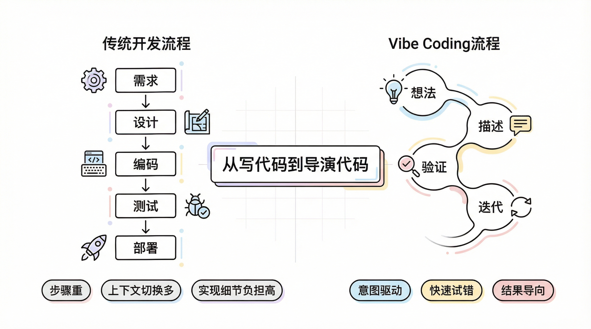
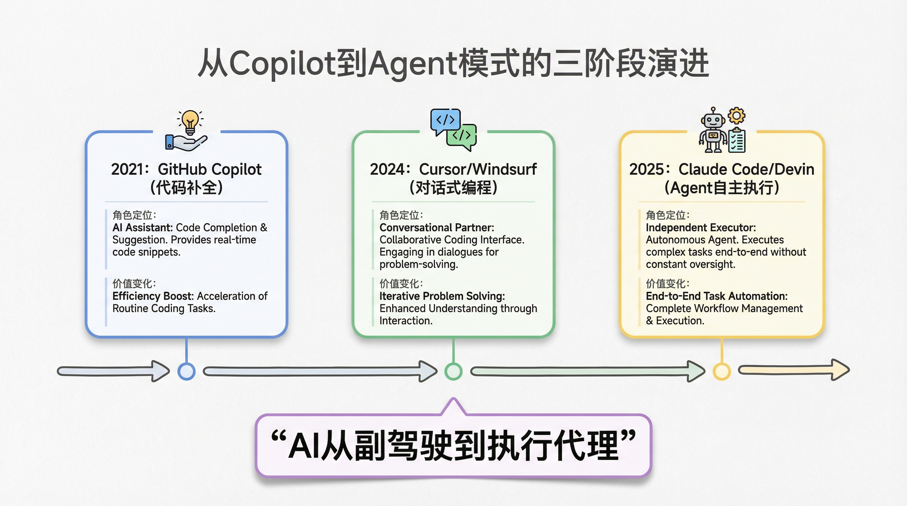
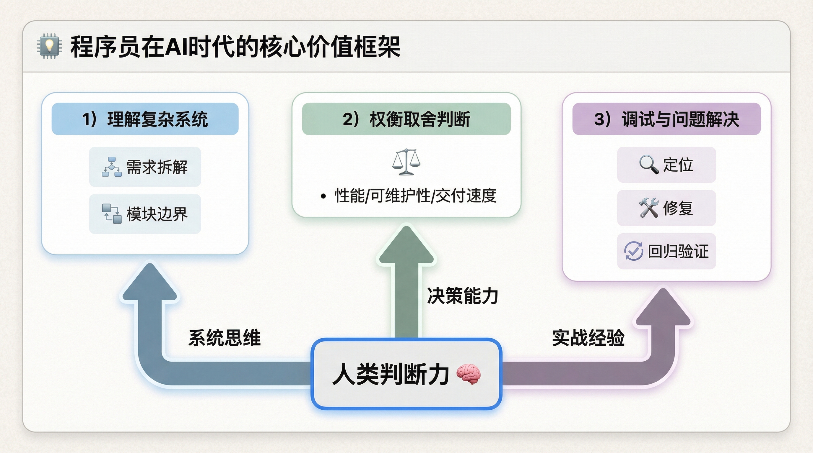
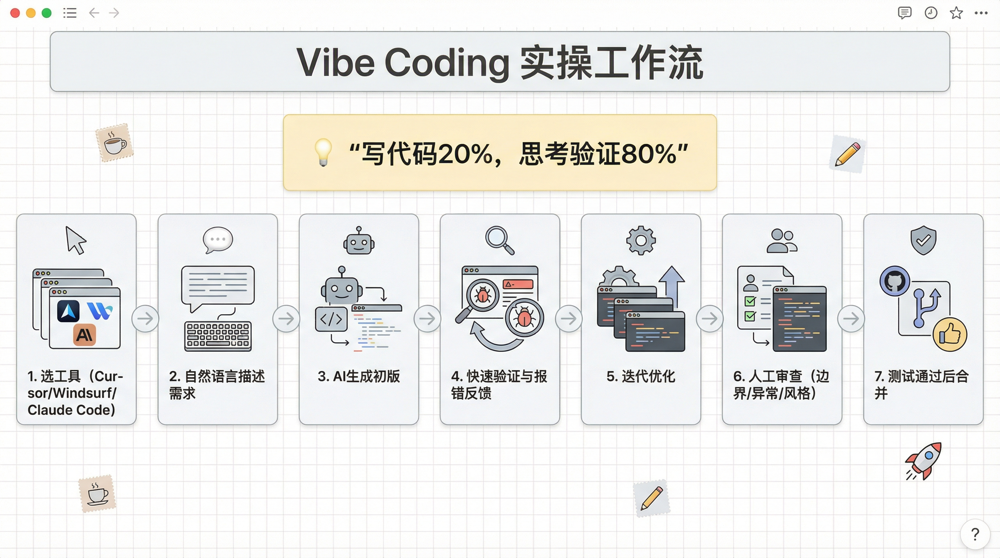
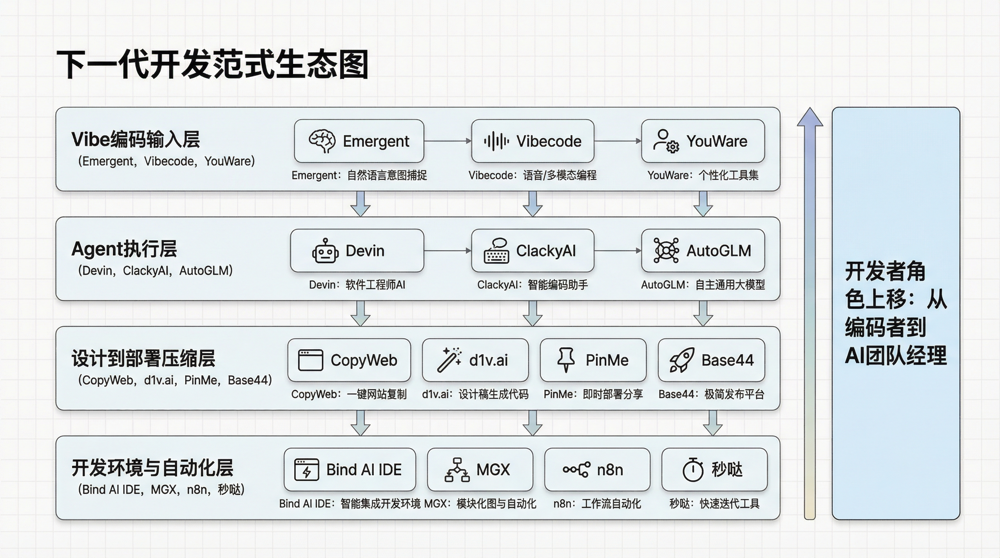

# Vibe Coding：当编程不再需要"写"代码，我们还在坚持什么？

## 开头钩子：那个不写代码的周末

上周发生了一件挺魔幻的事。

我一个写了十年代码的老程序员，整整两天没敲几行代码，却搞定了三个功能模块。不是我在偷懒，而是我换了一种方式工作——对着 AI 说话，让它帮我写。

这就是最近火遍技术圈的 **Vibe Coding（氛围式编码）**。

Andrej Karpathy（前特斯拉 AI 总监、OpenAI 联合创始人）在几个月前发了条推文，说现在编程的方式变成了："English is the new programming language"。这句话像一颗炸弹，在开发者社区炸开了锅。

有人欢呼：终于不用再被语法折磨了！

有人焦虑：程序员是不是要失业了？

还有人质疑：这不过是高级点的代码补全，至于这么吹吗？

作为一个从设计师转行、写了十年代码的人，我想跟你聊聊这背后的真相——**Vibe Coding 到底改变了什么，又没改变什么**。

---

## 痛点场景：我们都被"写代码"这件事折磨过

先问大家一个问题：

你还记得第一次学编程时，被语法错误支配的恐惧吗？

一个分号漏了，程序崩了。一个括号不匹配，编译报错。好不容易逻辑理顺了，运行时又抛出异常。那种"明明思路清晰，却被工具卡脖子"的挫败感——说实话，我太懂了，到现在想起来都还有点PTSD。

后来我们学会了各种框架、设计模式、最佳实践。代码写得越来越"规范"，但开发速度似乎并没有成正比提升。有时候甚至觉得，写的代码越多，离真正的"解决问题"越远。

这事儿我琢磨了很久。

**编程的本质从来不是打字速度，而是解决问题的思路。**但过去几十年，我们一直被迫在"思考"和"翻译"之间来回切换——脑子里想的是"我要实现一个登录功能"，手上却要敲出几百行配置代码、接口定义、状态管理...

这个过程就像你想跟外国朋友聊天，却必须先查词典、背语法，把想说的话逐字翻译成外语。效率能高吗？

Vibe Coding 要解决的就是这个痛点。

---

## 什么是 Vibe Coding：不只是"AI 写代码"这么简单

很多人以为 Vibe Coding 就是让 AI 代劳写代码，自己当甩手掌柜。怎么说呢，这理解有点太浅了。

Karpathy 的原话是：

> "我完全投入在氛围（vibes）中，拥抱奇想，忘记代码的存在。我只是看到、描述、运行和复制粘贴，这一切都很顺畅。"

注意这几个关键词：**拥抱奇想、忘记代码、顺畅**。

这不是简单的代码生成，而是一种**全新的创作流**。

传统的开发流程是：需求 → 设计 → 编码 → 测试 → 部署。每个阶段都有明确的产出物和交接点，像一条流水线。

Vibe Coding 的流程更像是：**想法 → 描述 → 验证 → 迭代**。你就像一个导演，告诉 AI 你想要的"氛围"，它去尝试各种实现方式，你只需判断是否"对味"。不需要在意具体怎么实现的，只关注结果是不是你想要的那个"感觉"。

举个例子。

上周我想做一个批量重命名文件的工具。以前的做法是：查 Python 的 os 模块文档，写遍历逻辑，处理异常，测试边界情况...少说也得半小时。

用 Vibe Coding 的方式，我直接对 Claude Code 说：

"帮我写一个脚本，批量把当前目录下所有 JPEG 文件按修改时间重命名，格式是 YYYYMMDD_序号.jpg，要处理文件名冲突的情况。"

30 秒后，代码有了。运行，报错，把错误信息丢给 AI，它修复。再运行，搞定。

整个过程我关注的不是"怎么写循环"，而是"我的需求是否被准确理解"。**思维层级从"实现细节"提升到了"意图表达"**。

---

## 工具进化：从 Copilot 到 Cursor 到 Claude Code

Vibe Coding 不是凭空冒出来的，它是一系列工具进化的结果。我算是完整经历了这三个阶段，感触挺深的。

**第一阶段：代码补全（GitHub Copilot）**

2021 年 Copilot 发布，那会儿真的是惊艳——你写注释，它猜代码；你写前半句，它补后半句。但现在回头看，它本质就是个"高级自动补全"。你依然是编码的主力，AI 只是打下手。

**第二阶段：对话式编程（Cursor、Windsurf）**

2024 年 Cursor 爆火，这算是真正的变革。你可以选中代码直接问："这段逻辑怎么优化？""这里为什么报错？""给我加上单元测试。"

这时候 AI 从"补全工具"变成了"结对编程搭档"。你开始用自然语言描述意图，而不是手写每一行代码。

**第三阶段：Agent 模式（Claude Code、Devin）**

到了 2025 年，Agent 模式开始普及。AI 不再只是回答问题，而是能**自主执行任务**。

你告诉它"帮我重构这个模块，提高可读性"，它会自己分析代码结构、制定重构计划、执行修改、运行测试、汇报结果。整个过程你可以全程旁观，只在关键节点做决策。这种感觉就像突然有了个靠谱的实习生，你只需要把控方向，脏活累活它全包了。

这才是真正的 Vibe Coding——**你负责"想"，AI 负责"做"，双方在一个流畅的"氛围"中协作**。

---

## 深度追问：程序员的价值在哪里？

说到这里，你可能会有一个疑问：

**如果 AI 能写代码了，程序员的价值还剩什么？**

这个问题我思考了很久。答案可能会让你意外——

**程序员的价值从来没有变过，只是终于从"体力劳动"中解放出来了。**

编程的核心能力从来都不是"写代码"，而是：

1. **理解复杂系统的能力**——把模糊的业务需求拆解成可执行的模块
2. **权衡取舍的判断力**——性能 vs 可维护性、交付速度 vs 代码质量
3. **调试和解决问题的经验**——知道问题可能出在哪、如何定位、如何修复

这些能力，AI 目前还不具备。它需要你来引导、判断、把关。

Vibe Coding 改变的只是**表达这些能力的方式**。以前是手写代码来表达，现在是用自然语言 + 代码审查来表达。

就像摄影技术的发展并没有让摄影师失业，而是让他们从"调光圈快门"的繁琐中解放出来，更专注于构图和创意。

---

## 实操建议：如何开始 Vibe Coding

如果你也想尝试这种新的工作方式，说几点我实际用下来觉得有用的建议。

**选对工具**

日常开发我推荐 Cursor 或 Windsurf，集成度高，体验流畅。复杂任务上 Claude Code，它的 Agent 能力确实强，适合深度协作。如果只是随手问个问题，GitHub Copilot Chat 也够用了。

**转变思维方式**

最重要的一点是：别再把 AI 当"高级搜索引擎"，要把它当"初级开发搭档"。这意味着——

描述需求时要具体、完整，就像给刚入职的新人布置任务那样。接受"试错-反馈-修正"的循环，别期待一次到位。最重要的是，保持对代码的审查和把控，不要盲目信任 AI 的产出，它真的会犯一些低级错误。

**建立新的工作流**

我的典型 Vibe Coding 工作流是这样的：

先用自然语言描述需求，让 AI 生成初版代码。然后快速验证核心逻辑是否符合预期，不对就指出问题让它改。接着提出具体改进点，让 AI 迭代优化。最后人工审查边界情况、异常处理、代码风格，测试通过就合并。

整个过程下来，我写代码的时间可能只占 20%，但思考和验证的时间占 80%。**说实话，质量反而更高了**——因为把精力花在了真正该花的地方。

---

## 价值升华：从"写代码"到"设计体验"

最后想说一点更深层的思考，可能也是我这几年感触最深的。

作为一个从设计转行过来的开发者，我发现 Vibe Coding 让编程越来越像**设计工作**。

设计师不会亲自生产颜料、裁剪画布，他们的价值在于创意和决策。现在，程序员终于也可以从"生产代码"的琐碎细节中解放出来，把精力放在真正重要的事情上——这个功能的用户体验是不是够流畅？这个架构能不能支撑未来的扩展？这个方案是不是真的解决了用户的痛点？

**我们终于可以不再被工具束缚，而是让工具为我们服务。**

这让我想起很喜欢的一句话：

> "技术应该让你更自由，而不是更忙碌。"

Vibe Coding 的终极意义，不是让我们偷懒不写代码，而是让我们**回归到编程最本质的乐趣——创造本身**。

---
## 以“氛围编码”（Vibe Coding）和AI智能体（Agent）为核心的下一代应用开发范式。

这不仅仅是工具列表，而是对整个软件开发工作流的重构宣言。

核心主题：从“精确编码”到“意图驱动”的开发革命

这些工具共同描绘了一个未来：开发者的角色将从“写代码的工程师”转变为“定义目标、提供氛围和约束的指挥官”。

1. “氛围编码”（Vibe Coding）成为主流范式
   • 核心理念：用自然语言描述（氛围、意图、功能）来生成和迭代整个应用或模块，而非逐行编写具体代码。

   • 代表工具：

     ◦ Emergent（世界首个Agentic氛围编码平台）、Vibecode Workspace、YouWare的“AI Vibe Coding Editor”直接点明主题。

     ◦ Rork（几分钟内氛围编码一个移动应用）、Capacity（几秒钟内用AI构建全栈应用）、bolt.new、cto.new 等工具都体现了这一“快速从想法到成品”的理念。

2. AI智能体深度嵌入开发全流程
   • 编码助手进化：从Devin（完全自主的AI软件工程师）到 ClackyAI（10倍速编码与PR自动化的Agentic CDE），AI正从“副驾驶”变为“主驾驶员”。

   • 垂直领域智能体：如BROWSERfly（生活在浏览器中的AI代理）、Open-AutoGLM（开源手机智能体框架）、Droidrun（让AI控制Android），智能体开始接管特定环境或任务。

3. “设计 → 代码 → 部署”链路的极致压缩与自动化
   • 设计即代码：CopyWeb（将网页设计复制为代码）、Copy design from any website、Aura（创建美丽设计）等工具消除了设计与实现之间的鸿沟。

   • 一键部署与全栈生成：PinMe（几秒内部署站点）、d1v.ai（零代码全栈应用与自动集成）、Base44（用AI在几分钟内构建应用）让应用发布变得像发布一条微博一样简单。

4. 开发环境的重构与新平台崛起
   • 新型IDE：Bind AI IDE（代码编辑器与AI聊天融合）、MGX、Repilt Templates，环境本身内置了强大的AI协作与生成能力。

   • 自动化与集成：n8n（强大的工作流自动化）、All Hands AI、秒哒（生成式应用开发平台）强调将开发流程本身自动化。

总结与洞察

• 对开发者：工作重心将上移。核心技能从语法记忆、框架细节，转变为精准描述需求、设定约束条件、评估与迭代AI产出、进行系统架构设计。开发者将成为“AI团队的经理”。

• 对创业者与产品经理：“我有一个想法”到“我有一个产品”的路径被无限缩短。利用这些工具，个人或极小团队可以在几小时或几天内验证一个复杂的数字产品原型，极大降低了创新门槛。

• 趋势融合：“氛围编码”提供输入方式，AI智能体担任执行引擎，而自动化部署平台构成交付闭环。这三者正融合成一个全新的、高度流畅的开发体验。

如果您身处技术或产品领域，现在正是探索这些工具、适应这一新范式的最佳时机。可以从一个具体需求出发（例如“用v0快速生成一个登录聊天页面设计”，或用Rork尝试构建一个简单的移动应用），亲身感受这场正在发生的开发革命。

## 互动引导

你尝试过 Vibe Coding 吗？体验如何？

是觉得"真香"还是"还是自己动手靠谱"？

欢迎在评论区聊聊你的想法。如果你有好用的 AI 编程技巧，也欢迎分享。

---

*附：本文涉及的工具*
- Claude Code: https://claude.ai/code
- Cursor: https://cursor.com
- Windsurf: https://codeium.com/windsurf
- GitHub Copilot: https://github.com/features/copilot
