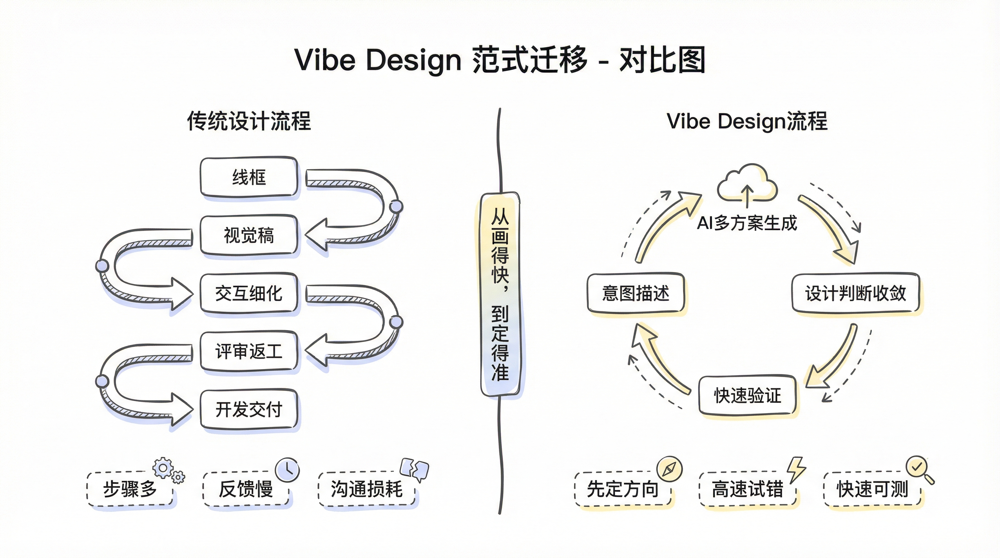
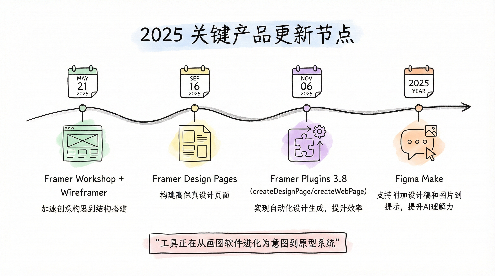
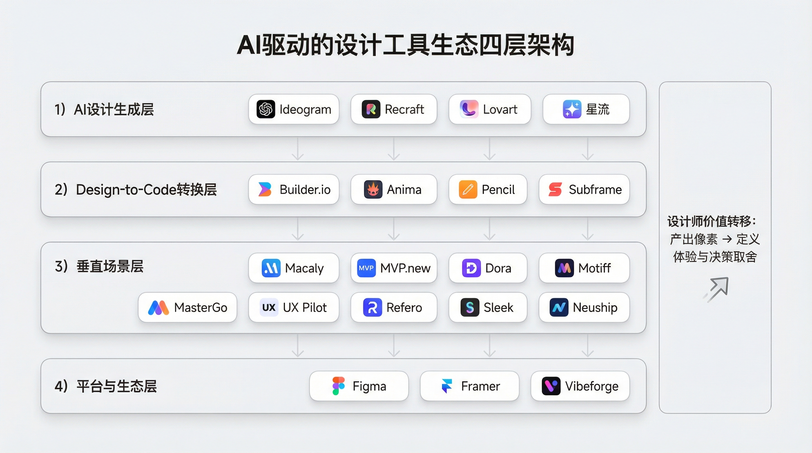
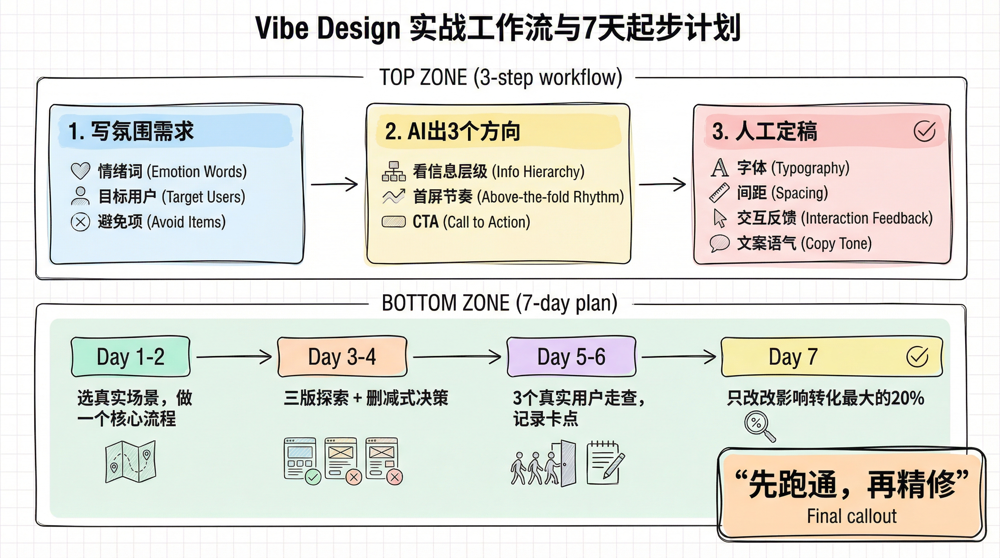

## 我没画一个像素，却做出了可用原型：Vibe Design 正在改写设计流程

1. 冲突对比型：`我没画一个像素，却做出了可用原型：Vibe Design 正在改写设计流程`
2. 疑问引导型：`Vibe Design 到底是设计师的外挂，还是新的“幻觉工厂”？`
3. 数字效果型：`7天上手 Vibe Design：把“想法”变成“可测原型”的实战路径`
4. 否定反转型：`别再只会堆提示词了：Vibe Design 的关键不是“会问”，而是“会定稿”`

---

# 我没画一个像素，却做出了可测原型：Vibe Design 正在改写设计流程

上周我做了个小实验。

我没有先开 Figma 拉框，也没有先写组件规范。

我只写了一句话：
“给新手做一个 AI 工具首页，感觉要轻、快、可信，不要科技感过重。”

20 分钟后，我手里已经有了可以点、可以改、可以拿去聊需求的版本。

那一刻我很确定：设计流程正在变。

这就是我理解的 **Vibe Design（氛围式设计）**。

它不是“偷懒式出图”，而是把设计师从“手工执行者”推向“意图导演”。

**你负责定义感觉与边界，AI 负责高速试错与生成。**

## Vibe Design 到底在变什么

以前我们做设计，常见路径是：线框、视觉、交互、评审、返工。

每一步都专业，但每一步都慢，尤其在需求还模糊的时候。

Vibe Design 把顺序改了。

先把“想要的体验”说清楚，再让 AI 快速生成多个方向，然后用设计判断力做收敛。

不是先把图画精，再验证；而是先把方向跑通，再做精修。

说白了，从“画得快”升级为“定得准”。

## 为什么是现在

我看了最近一轮工具更新，信号很密集。

2025 年 5 月，Framer 上线 `Workshop`，可以用描述直接生成组件；同天也推了 `Wireframer`。

2025 年 9 月，Framer 推出 `Design Pages`，明确把“自由探索”放到流程前面。

2025 年 11 月，Framer 插件支持 `createDesignPage` / `createWebPage`，自动化链路更完整。

Figma 这边，`Figma Make` 也已经支持把设计稿和图片附到提示里，直接生成可运行原型。

这些更新放在一起看，很明显：工具厂商不再只做“画图软件”，而是在做“从意图到原型”的系统。

## AI驱动的设计与产品开发工具生态

它们不是“工具堆砌”，而是在告诉我们：Vibe Design 已经形成完整生态。

第一层是 **AI 设计生成层**。

像 Ideogram、Recraft、Lovart、星流这类工具，重点解决“从灵感到视觉草案”的速度问题。

你用自然语言给方向，它给你第一版可讨论的结果。

第二层是 **Design-to-Code 转换层**。

Builder.io、Anima、Pencil、Subframe 这类工具，本质在压缩“设计到交付”的距离。

过去设计稿和前端常常来回拉扯，现在这条链路在被直接打通。

第三层是 **垂直场景层**。

给创业者的有 Macaly、MVP.new、Dora，强调快速做出可验证产品。

给 UI/UX 的有 Motiff、MasterGo、UX Pilot、Refero，强调在专业流程里提高探索和迭代效率。

给移动端和特定媒介的有 Sleek、Neuship，强调特定场景的深度优化。

第四层是 **平台与生态层**。

Figma、Framer、Vibeforge 这类平台的演进方向一致：把设计、原型、协作、发布逐步收敛到一条连续工作流里。

**设计师的核心价值，正从“产出像素”转向“定义体验与决策取舍”。**

## 我现在怎么用 Vibe Design（实战版）

我自己的流程只有三步。

第一步，写“氛围需求”而不是“页面需求”。

我会先写情绪词、目标用户、避免项。

比如：可信、克制、有引导；避免“炫技感”和“信息噪音”。

第二步，让 AI 一次给 3 个方向。

不要一上来就抠细节，先看结构差异：信息层级、首屏节奏、CTA 位置。

第三步，人工定稿。

这一步最关键。字体、间距、交互反馈、文案语气，我会自己收。

因为 AI 能给速度，但“品牌判断”和“取舍责任”必须是人来扛。

**Vibe Design 的本质，不是让 AI 替你设计，而是让你更快进入设计决策。**

## 两个坑，不避开很容易翻车

第一个坑：把“会提问”当成“会设计”。

提示词只是入口，不是能力本身。

没有信息架构和体验判断，出的图再快也只是草台班子。

第二个坑：过早追求完美视觉。

很多人第一轮就开始调阴影、调圆角，结果方向本身错了。

先确认用户路径，再谈像素级精修，效率会高很多。

## 给你的 7 天起步建议

Day 1-2：选一个真实小场景，只做一个核心流程。

Day 3-4：让 AI 出三版，强制自己做“删减式决策”。

Day 5-6：拉 3 个真实用户走流程，记录卡点。

Day 7：只改最影响转化的 20%，不要全改。

你会发现，真正拉开差距的不是“谁生成得快”，而是谁能更快把模糊需求变成可验证方案。

## 结尾

Vibe Design 不会让设计师消失。

它只会淘汰一种工作方式：只会执行，不会判断。

未来最值钱的设计师，依然是那类人：

能看懂业务，能定义体验，能把混乱变成秩序。

只是现在，多了一个几乎不知疲倦的 AI 搭档。