# AI编程从0到1之10X提效

> 落实 AI 辅助编程到驾驭 AI 编程全篇章: IDE 编辑器, LLM 编码模型, CLI 终端, Extensions/Plugins 扩展插件, Agents 智能体, AI 工作流编排, Agent Skills 技能, MCP 协议, Vibe Design, Vibe Build

---

## 项目愿景

本项目是一套完整的 AI 辅助编程知识体系，从基础工具认知到高阶工程实践，帮助开发者实现 10 倍效率提升。内容覆盖从 IDE 编辑器选择到 Vibe Coding 氛围式编码的完整技术栈。

---

## 架构总览

本项目采用模块化内容结构，共 10 个核心篇章，形成从工具认知到工程实践的完整学习路径。

```mermaid
graph TD
    A["(根) AI编程从0到1之10X提效"] --> B["01 IDE编辑器"]
    A --> C["02 LLM编码模型"]
    A --> D["03 CLI终端工具"]
    A --> E["04 Extensions/Plugins扩展插件"]
    A --> F["05-A Agents智能体"]
    A --> G["05-B AI工作流编排"]
    A --> H["06 Agent Skills技能"]
    A --> I["07 MCP协议"]
    A --> J["08 Vibe Design"]
    A --> K["09 Vibe Build"]
    A --> L["10 Serverless API"]

    click B "./AI编程从0到1之10X提效（AI IDE编辑器 ）01篇.md" "查看 IDE 编辑器篇章"
    click C "./AI编程从0到1之10X提效（AI LLM厂商及模型 ）02篇.md" "查看 LLM 模型篇章"
    click D "./AI编程从0到1之10X提效（AI 终端 ）03篇.md" "查看 CLI 终端工具篇章"
    click E "./AI编程从0到1之10X提效（AI Extensions Plugins 扩展插件 ）04篇.md" "查看扩展插件篇章"
    click F "./AI编程从0到1之10X提效（AI Agents 智能体 ）05-A 篇.md" "查看 Agents 智能体篇章"
    click G "./AI编程从0到1之10X提效（AI 工作流编排）05-B 篇.md" "查看 AI 工作流编排篇章"
    click H "./AI编程从0到1之10X提效（Agent Skills）06篇.md" "查看 Agent Skills 技能篇章"
    click I "./AI编程从0到1之10X提效（Mcp 协议）07篇.md" "查看 MCP 协议篇章"
    click J "./AI编程从0到1之10X提效（Vibe Design 氛围式设计 ）08篇.md" "查看 Vibe Design 篇章"
    click K "./AI编程从0到1之10X提效（Vibe Coding 氛围式编码 ）09篇.md" "查看 Vibe Coding 篇章"
    click L "./AI编程从0到1之10X提效（Serverless API  服务接口 ）10篇.md" "查看 Serverless API 篇章"
```

---

## 模块索引

| 模块 | 文件 | 一句话职责 |
|------|------|-----------|
| 01 IDE编辑器 | `AI编程从0到1之10X提效（AI IDE编辑器 ）01篇.md` | AI 驱动 IDE 选型与高效使用方法论 |
| 02 LLM编码模型 | `AI编程从0到1之10X提效（AI LLM厂商及模型 ）02篇.md` | 2026 年全球顶尖 AI 模型全景与选型指南 |
| 03 CLI终端工具 | `AI编程从0到1之10X提效（AI 终端 ）03篇.md` | Top10 CLI AI 编程工具对比与选型 |
| 04 Extensions/Plugins | `AI编程从0到1之10X提效（AI Extensions Plugins 扩展插件 ）04篇.md` | 插件层能力搭建与工程化实践 |
| 05-A Agents智能体 | `AI编程从0到1之10X提效（AI Agents 智能体 ）05-A 篇.md` | Agent 工程化工具图谱与落地路径 |
| 05-B AI工作流编排 | `AI编程从0到1之10X提效（AI 工作流编排）05-B 篇.md` | 从单点工具到系统交付的编排方法论 |
| 06 Agent Skills | `AI编程从0到1之10X提效（Agent Skills）06篇.md` | 可复用 Agent 技能设计与沉淀 |
| 07 MCP协议 | `AI编程从0到1之10X提效（Mcp 协议）07篇.md` | Model Context Protocol 入门与生态 |
| 08 Vibe Design | `AI编程从0到1之10X提效（Vibe Design 氛围式设计 ）08篇.md` | AI 驱动的氛围式设计方法论 |
| 09 Vibe Build | `AI编程从0到1之10X提效（Vibe Coding 氛围式编码 ）09篇.md` | Vibe Coding 氛围式编码实践指南 |
| 10 Serverless API | `AI编程从0到1之10X提效（Serverless API  服务接口 ）10篇.md` | Serverless API 服务接口设计 (占位) |

---

## 学习路径建议

### 初学者路径
1. **01 IDE编辑器** - 选择适合的工具
2. **02 LLM编码模型** - 了解模型能力边界
3. **03 CLI终端工具** - 掌握命令行 AI 工具
4. **04 Extensions/Plugins** - 搭建插件层能力

### 进阶者路径
5. **05-A Agents智能体** - 理解 Agent 工作模式
6. **05-B AI工作流编排** - 掌握多工具协同
7. **06 Agent Skills** - 沉淀可复用技能
8. **07 MCP协议** - 打通工具生态

### 高阶实践路径
9. **08 Vibe Design** - AI 驱动设计思维
10. **09 Vibe Build** - 氛围式编码实践
11. **10 Serverless API** - 服务化部署能力

---

## 核心方法论

### 1. 工具选型四约束
- 网络与合规
- 主要开发场景
- 模型可切换性
- 验证能力

### 2. 少返工闭环
1. 先把边界说清楚（目标、约束、验收）
2. 先要"计划"，再要"代码"
3. 写完立刻要求自查
4. 报错就把"证据"喂回去

### 3. 7天落地法
每个篇章都提供 7 天落地计划，从痛点识别到可复用系统。

---